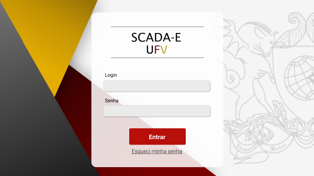

    

## 💻 Tecnologias

Esse projeto foi desenvolvido com as seguintes tecnologias:

- CSS
- HTML
- JavaScript
- PHP
- MySQL

----------------------------------------------------------------------------------------------

## 💻 Projeto

Sistema web para coleta e análise de dados de alunos egressos (SCADA-E) dos seguintes cursos: técnico em informatica e bacharel em ciencia da computação, ambos da UFV - Campus Florestal

----------------------------------------------------------------------------------------------

## 🔖 Layout

Você pode visualizar o layout do projeto através [desse link](https://www.figma.com/file/DfUvB2XXN0C96KNdlrbNwL/SCADA-E?node-id=0%3A1). É necessário ter conta no [Figma](https://figma.com) para acessá-lo.

----------------------------------------------------------------------------------------------

Esse projeto foi feito como trabalho de conclusão de curso do curso de Bacharel em Ciência da Computação